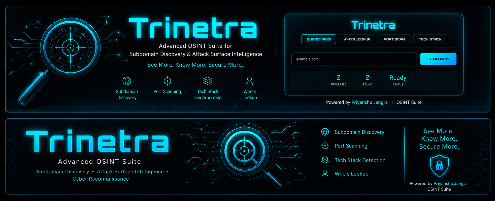

# 🕵️ Trinetra - Web OSINT Tool

  

> Trinetra is a powerful open-source Web OSINT (Open Source Intelligence) tool designed to gather critical information about target domains. It automates the process of WHOIS lookup, Subdomain enumeration, and Port Scanning.

## ✨ Features

Trinetra comes packed with essential OSINT capabilities:

*   **🌐 Domain Reconnaissance:** Fast WHOIS discovery to identify ownership details.
*   **🚢 Port Scanning:** Identify open ports and running services on target IPs.
*   **🔍 Subdomain Enumeration:** Discover subdomains associated with the main domain.
*   **📡 Real-time Data:** efficient crawling and retrieval of public records.
*   **📄 Exportable Reports:** Save your findings for offline analysis.

## 🛠️ Technology Stack

*   **Backend:** (e.g., Python / Flask or Node.js)
*   **Frontend:** (e.g., HTML5, CSS3, JavaScript)

  ## 🎯 Uses of Trinetra

- **Cybersecurity Research**  
  Gather information about potential vulnerabilities of a domain before conducting security audits.

- **Penetration Testing**  
  Collect reconnaissance data about target systems during authorized red team operations.

- **Threat Intelligence**  
  Monitor and track malicious domains, phishing sites, or suspicious URLs.

- **Domain Investigation**  
  Identify domain owners, registration dates, and contact details for legitimate research.

- **Bug Bounty Hunting**  
  Discover subdomains and open ports to find attack surfaces for bug bounty programs.

- **Brand Protection**  
  Monitor for fake domains or websites impersonating your brand.

- **Incident Response**  
  Investigate attacks by analyzing threat actor infrastructure like IPs and domains.

- **Competitive Intelligence**  
  Understand the digital presence of competitors, their technology stack, and subdomains.

- **Law Enforcement**  
  Assist authorities in tracking illegal or fraudulent websites.

- **Personal Security**  
  Check if your personal or company domain is exposed online.

  ## ⚠️ Disclaimer

**Trinetra is developed for educational and authorized use only.**

- This tool is intended to help users learn about **OSINT techniques** and understand how open-source intelligence gathering works.
- Users must obtain **explicit permission** before scanning any domain or network that they do not own or have authorization to test.
- **Misuse** of this tool for malicious purposes is strictly prohibited and may violate local, national, or international laws.
- The developer **does not accept any responsibility** for any damage or legal consequences caused by the misuse of this tool.
- Use this tool responsibly and ethically at all times.
